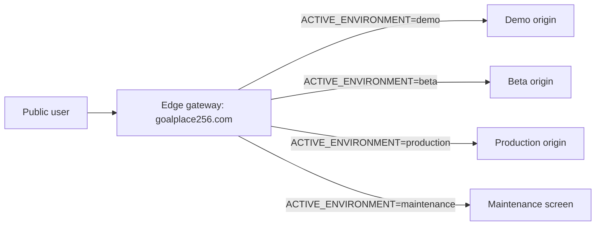

# GoalPlace256 Environment Activation

> **Status: designed, not implemented.** The `environment:prepare:*` commands validate
> configuration, record the intended target and write an audit report. **They do not switch
> public traffic.** No edge gateway, DNS change, App Hosting routing change or cache purge
> is performed, and no database is mutated. The routing model described below is the target
> design; until it exists, `goalplace256.com` keeps serving whatever it served before.
>
> The commands are named `prepare`, not `activate`, for exactly this reason.

GoalPlace256 uses one public URL and isolated backing environments. Switching the public experience changes traffic routing only. It must not copy, delete, or migrate an entire dataset.

## Public Model

The permanent public URL is:

```text
https://goalplace256.com
```

Until the custom domain is purchased, use the current App Hosting URL as the public URL by setting `GOALPLACE_PUBLIC_URL`.

Only one public state may be active at a time:

- `demo`
- `beta`
- `production`
- `maintenance`

Inactive origins must require a gateway-origin secret or staff preview secret. They should never be promoted as public links inside the product.



## Environment Contracts

Demo is the investor showroom. It uses the populated synthetic dataset, demo accounts, investor tools, and no real payments.

Beta is the invite-only testing environment. It must use a separate Firebase project, resettable test data, and sandbox-only payments.

Production starts clean. It must not include demo users, synthetic records, investor tools, mock fallback, sandbox callbacks, or real payments before the separate money launch gate.

Every active environment that sends operational email must configure `GOALPLACE_APP_BASE_URL`,
`GOALPLACE_EMAIL_FROM`, and an App Hosting Secret Manager reference named `resendApiKey`.
Activation rejects plaintext `RESEND_API_KEY` values in App Hosting config.

Each app exposes:

- `environment`
- `environmentVersion`
- `firebaseProjectId`
- `dataMode`

The browser compares those values on load. When they change, the app signs out, clears private local storage and cache namespaces, clears Firebase/offline IndexedDB data where possible, unregisters stale service workers, and reloads.

## Gateway Enforcement

Set these on environment origins when they must be reachable only through the gateway:

```text
GOALPLACE_REQUIRE_GATEWAY_SECRET=true
GOALPLACE_EDGE_ORIGIN_SECRET=...
GOALPLACE_STAFF_PREVIEW_SECRET=...
```

The gateway must attach:

```text
x-goalplace-origin-secret: <secret>
```

Authorized staff preview tooling may attach:

```text
x-goalplace-staff-preview-secret: <secret>
```

The app-level proxy returns access denied when origin protection is enabled and neither header is valid.

## Commands

Read current state:

```bash
npm run environment:status
```

Prepare demo:

```bash
GOALPLACE_ACTIVATION_IDENTITY="name@example.com" \
GOALPLACE_BACKUP_CONFIRMED=true \
GOALPLACE_HEALTHCHECK_PASSED=true \
GOALPLACE_CACHE_PURGED=true \
GOALPLACE_POST_SWITCH_SMOKE_PASSED=true \
npm run environment:prepare:demo
```

Prepare production:

```bash
GOALPLACE_ACTIVATION_IDENTITY="name@example.com" \
GOALPLACE_BACKUP_CONFIRMED=true \
GOALPLACE_HEALTHCHECK_PASSED=true \
GOALPLACE_CACHE_PURGED=true \
GOALPLACE_POST_SWITCH_SMOKE_PASSED=true \
GOALPLACE_PRODUCTION_CONFIRM="ACTIVATE GOALPLACE256 PRODUCTION" \
npm run environment:prepare:production
```

Enter maintenance:

```bash
GOALPLACE_ACTIVATION_IDENTITY="name@example.com" \
GOALPLACE_BACKUP_CONFIRMED=true \
GOALPLACE_HEALTHCHECK_PASSED=true \
GOALPLACE_CACHE_PURGED=true \
GOALPLACE_POST_SWITCH_SMOKE_PASSED=true \
npm run environment:maintenance
```

Rollback:

```bash
GOALPLACE_ACTIVATION_IDENTITY="name@example.com" \
GOALPLACE_BACKUP_CONFIRMED=true \
GOALPLACE_HEALTHCHECK_PASSED=true \
GOALPLACE_CACHE_PURGED=true \
GOALPLACE_POST_SWITCH_SMOKE_PASSED=true \
npm run environment:rollback
```

Every activation writes an ignored audit report under `reports/environment/` and updates `config/active-environment.json`.

## Activation Sequence

1. Validate the target environment in `config/environments.json`.
2. Verify the target app health.
3. Verify Firestore rules and Storage rules versions.
4. Verify expected Firebase project and data origin.
5. Verify payment mode.
6. Enable maintenance.
7. Change the gateway target.
8. Purge edge cache.
9. Bump the environment version.
10. Run public smoke tests.
11. Disable maintenance.
12. Record the activation event.

The local command records the protected control decision. The actual edge provider must consume the active state or equivalent deployment setting to route traffic.

## Production Clean-Start Guard

Run this before production deployment:

```bash
npm run prod:assert-clean
```

The guard rejects unsafe production configuration, including demo login, seeding, investor tools, mock mode, synthetic data mode, sandbox payments, demo/beta callback URLs, missing email sender/base URL configuration, plaintext Resend keys, and forbidden production App Hosting values.

Production activation will also refuse to run until the production project placeholders are replaced.

## Demo Data Lifecycle

Validate the protected demo seed:

```bash
npm run demo:validate
```

Export an audit record:

```bash
npm run demo:export
```

Protected reset/seed commands require an identity, a backup confirmation, and an exact typed confirmation phrase. These commands intentionally do not mutate Firestore by themselves; they create an auditable request and point operators to the approved reset workflow.
