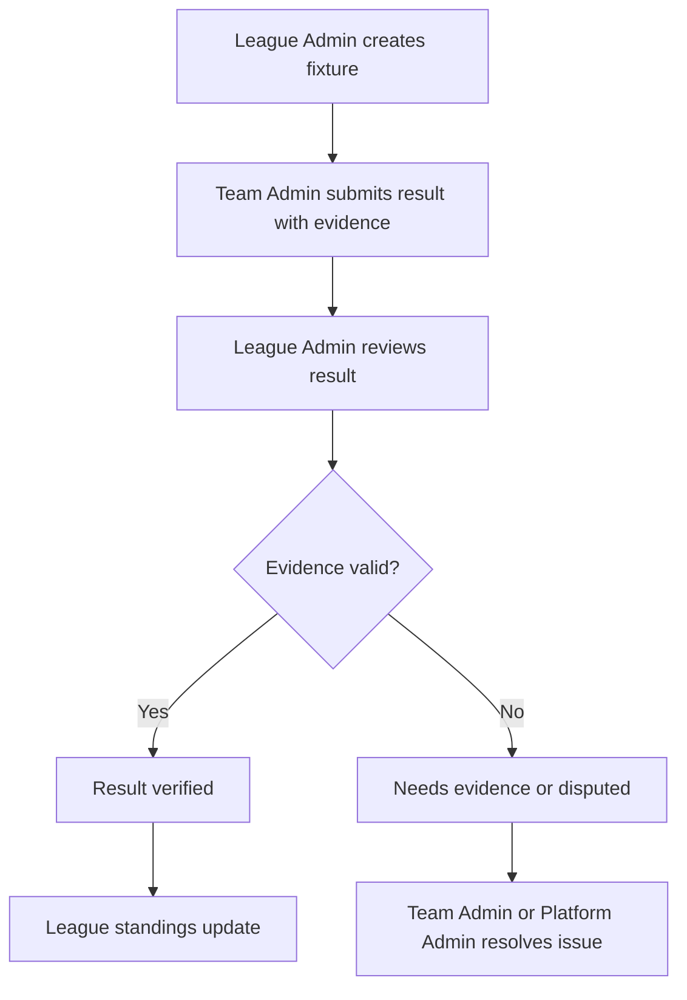
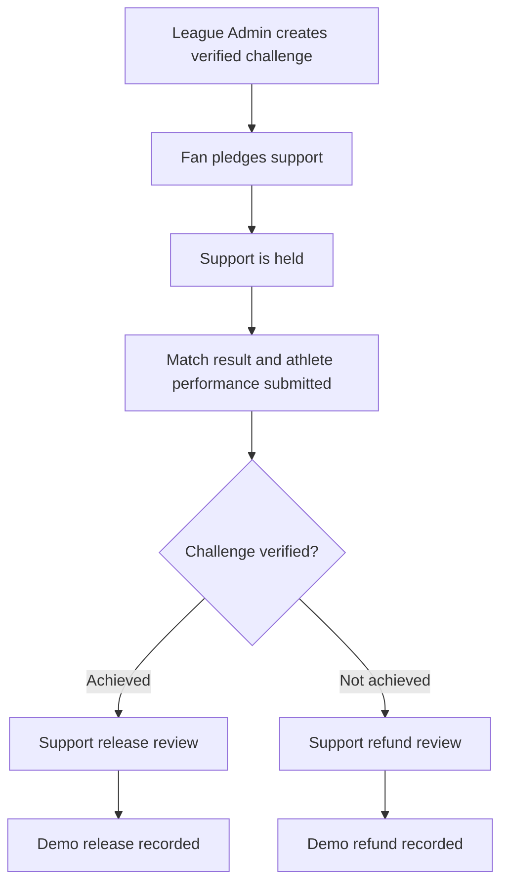
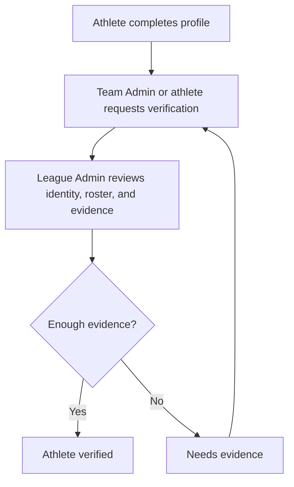
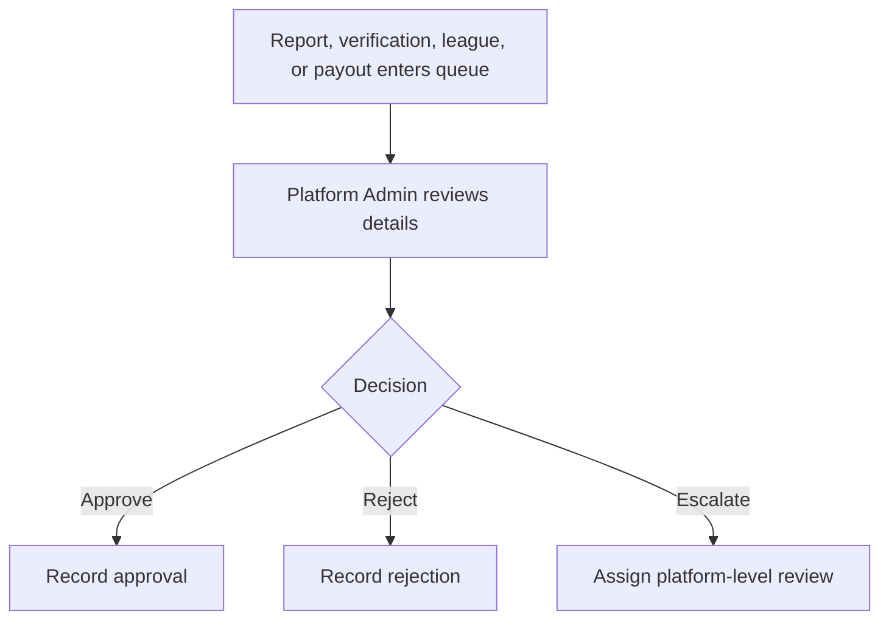

# GoalPlace256 Role UX Refinement Map

This document is the implementation contract for the five active app profiles:
Fan, Athlete, Team Admin, League Admin, and Platform Admin. Sponsor pages and packages remain business-facing content, but Sponsor is not an active app persona in login, register, or demo role switching.

## Role UX Map

| Role | Primary Goal | Main Surfaces | Primary Actions | Must See |
| --- | --- | --- | --- | --- |
| Fan | Follow sport and support verified athletes | Home, Feed, Matches, Athletes, Wallet, Profile | Support Athlete, Pledge Support, Follow Athlete, Save Post, Add Comment | Wallet balance, held support, verified content, followed athletes |
| Athlete | Build verified portfolio and manage supporter activity | Athlete Dashboard, Profile, Challenges, Matches, Media, Supporters, Wallet | Publish Highlight, Request Athlete Verification, Propose Verified Challenge, Create Athlete Post | Profile completion, verification status, support history, challenge status |
| Team Admin | Maintain a team and submit evidence | Team Console, Roster, Fixtures, Results, Updates, Team Profile | Add Athlete to Roster, Submit Match Result, Publish Team Update, Request Team Verification | Roster completeness, pending submissions, result evidence status, profile completeness |
| League Admin | Operate verified competition | League Ops, Teams, Fixtures, Verification, Standings, Reports | Create Fixture, Review Submitted Result, Invite Team Admin, Request League Verification | League standings, GoalPlace Index, verification queues, integrity note |
| Platform Admin | Protect platform integrity | Control Center, Approvals, Verification, Reports, Payouts, System | Approve League, Review Verification Evidence, Resolve Report, Review Payout Request | Pending approvals, reports, support release reviews, data mode, system health |

## Navigation Map

| Role | Navigation |
| --- | --- |
| Fan | Home, Feed, Matches, Athletes, Wallet |
| Athlete | Dashboard, Profile, Matches, Challenges, Supporters, Wallet, Media, Settings |
| Team Admin | Team Console, Roster, Fixtures, Results, Updates, Team Profile |
| League Admin | League Ops, Teams, Fixtures, Verification, Standings, Reports, Settings |
| Platform Admin | Control Center, Approvals, Verification, Reports, Payouts, System, Users, Settings |

Mobile keeps the first four role tasks visible when there are more than five destinations and places the rest behind More. Content keeps bottom padding through `PageContainer` so the bottom nav does not cover primary actions.

## Status System

Every reusable status chip should include:

| Requirement | Implementation |
| --- | --- |
| Label | Human-readable text such as Pending Verification |
| Color | Tone from neutral, info, warning, danger, success, gold |
| Explanation | Short reason for the current state |
| Owner | Person or team responsible for the next action |
| Next step | Concrete action needed to progress |

Implemented in `STATUS_SYSTEM` and `StatusExplainerChip` in `src/components/ui/product.tsx`.

## Page Specs

### Home

Home is role-aware. It uses the active role configuration for title, quick actions, account actions, and dashboard shortcuts.

### Feed

Feed separates official updates, match results, fan posts, highlights, verified achievements, and awards. Verified content is filterable instead of mixed into a generic stream.

### Matches

Matches are filtered by sport, stage, and verification status. Completed results that are not verified stay labeled Pending Verification.

### Athletes

Athlete cards show sport, team, league, verification status, support need, stats, profile completion, and support actions.

### Team Admin

Team Admin is task-first:

| Area | Required Display |
| --- | --- |
| Overview | Roster completeness, pending submissions, support pool, team verification status |
| Roster | Athlete status, profile completion, edit athlete details |
| Fixtures and Results | Submitted match result status, evidence review action, standings warning |
| Athlete Updates | Publish highlight, add support need, request team verification |
| Team Profile | Public completeness, public status, edit team profile |

### League Admin

League Admin separates:

| Section | Meaning |
| --- | --- |
| League Standings | Based only on verified match results |
| GoalPlace Index | Based on platform quality signals like verification, completion rate, profile completion, engagement, support activity, admin reliability, and media uploads |

Required explanatory copy:

> League standings are based only on match results. Paid tools never affect sporting rankings.

### Platform Admin

Platform Admin actions should identify exact work: View Verification Evidence, Approve Verification, Resolve Report, Escalate Report, Review Payout Request, Export Demo Data.

## Button Action Audit

| Old Label | New Label |
| --- | --- |
| Review | Review Match Results, Review Challenge Outcomes, Review Team Submissions |
| View | View Match Details, View Athlete Profile, View Verification Evidence, View Report Details |
| Edit | Edit Personal Info, Edit Athletic Details, Edit Athlete Details, Edit Team Profile |
| Submit | Submit Match Result |
| Update | Add Athlete Media, Publish Team Update |
| Save | Save Athlete Privacy, Save Athlete Notifications, Save Platform Setting |
| Escalate | Escalate Report, Escalate Feed Post |
| Support | Support Athlete |

## Mobile Spec

| Requirement | Spec |
| --- | --- |
| Bottom nav | Fixed bottom nav with safe area padding |
| Content padding | `PageContainer` uses bottom padding to avoid content being hidden |
| Overflow | Filter bars and action toolbars use horizontal scroll with hidden scrollbar |
| Cards | Mobile data cards avoid tables where actions need to stay readable |
| Buttons | Long action labels wrap and remain at least 44px tall |
| 390px width | No fixed-width elements should exceed viewport; data tables use internal scroll |

## Logic Flows

### Fixture and Result

### Challenge and Support

### Athlete Verification

### Platform Admin Review

